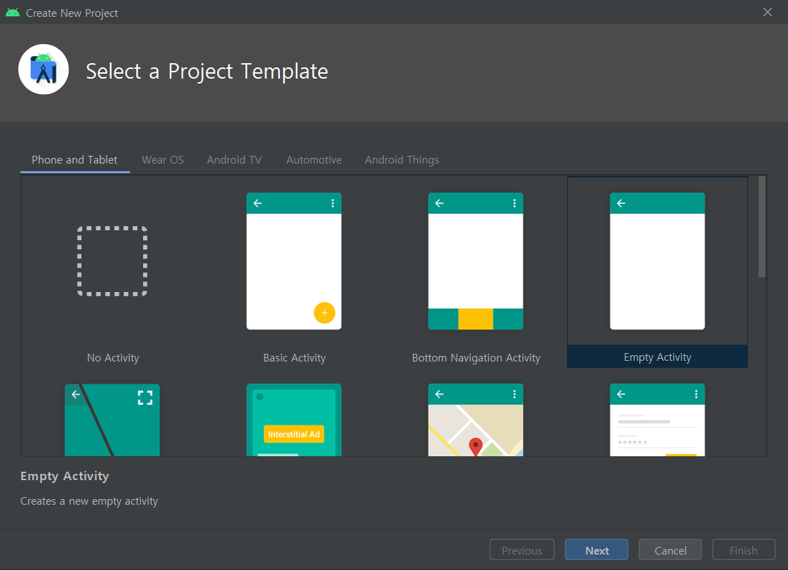
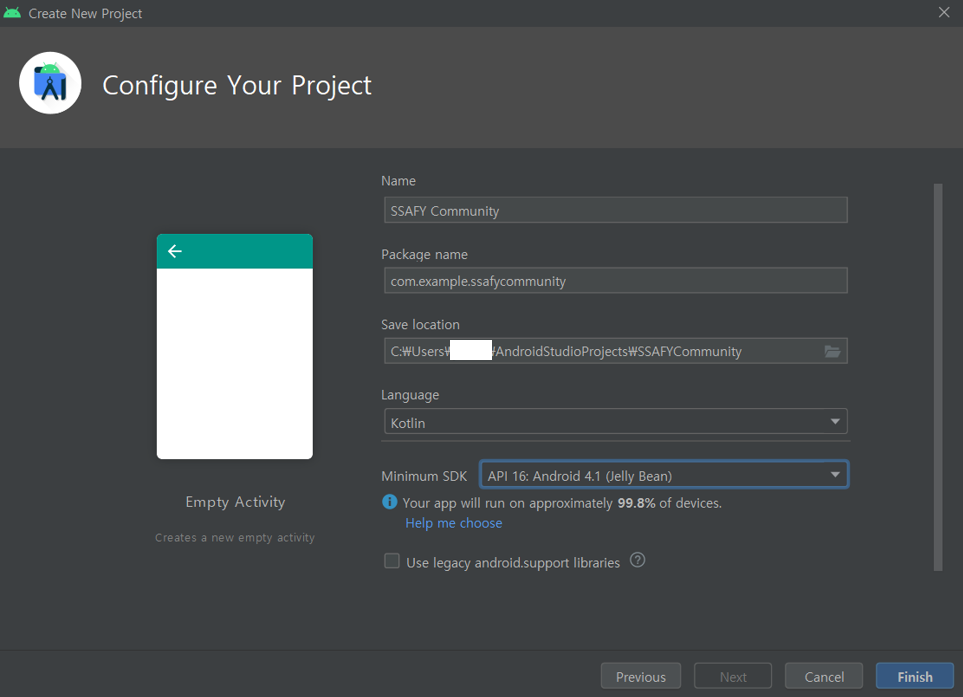

# 시작하기

##### 버전: 4.1.1

##### 언어: Kotiln

##### 1. 시작

- start project - Empty Activity

	

- 환경설정

  

  언어를 Kotlin으로 설정

  Minimum SDK - SDK의 최적화(현재 버전과 가장 어울리는 API를 선택해줍니다.)

  Finish를 클릭한다면 MainActivity.kt라는 파일이 생성됩니다.

- Kotlin을 사용하는 이유
  - 구글에서 2017년 5월 18일에 Kotlin을 공식 안드로이드 개발 언어로 선언
  - Kotlin은 JVM 언어의 하나로 자바보다 코드가 더 간결하고 Null 포인트 에러에 대한 대처가 더 효율적
  - 타입 선언없이 값을 바로 할당가능
  - 오버로딩 생성자를 간단하게 생성 가능
- kotlin online compiler를 통하여 온라인으로도 코딩이 가능하다.

  

