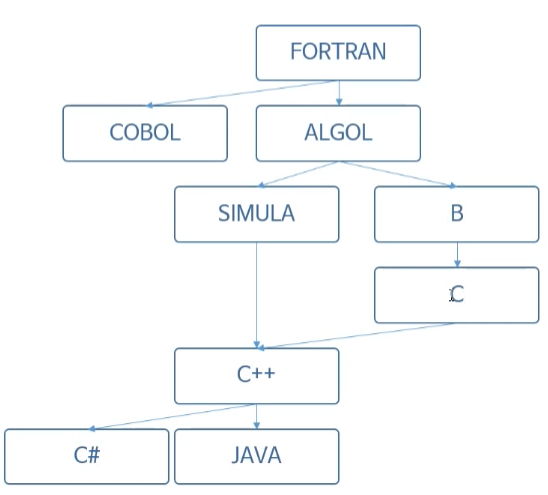

## 01. Java 프로그래밍이란?

##### 1) Java의 역사

- 1955년 제임스 고슬링에 의해서 탄생
- 썬 마이크로시스템즈에서 발표
- 가전제품에 탑재할 수 있는 프로그램을 개발하기 위한 목적으로 탄생

##### 2) Java의 특징

- Java 언어의 단점(초창기)
  - 기존 C/C++에 비해서 속도가 굉장히 느리다.(C/C++은 직접 메모리에 접근해서 관리가 가능하다. 반면, Java는 매개체를 두었다.)
  - 리소스(메모리, CPU)를 많이 사용한다.
- Java 언어의 장점(발전 후)
  - 객체 지향 언어로 기능을 부품화할 수 있다. (부품별로 재사용이 가능하다.)
  - JRE를 이용해서 운영체제로부터 자유롭다. (운영체제별 JRE 설치를 하면 어디서든 사용이 가능하다. 코딩을 최초 한 번만 하면 된다.)
  - 웹 및 모바일 프로그래밍(안드로이드)이 쉽다.
  - GC(Garbage Collector)를 이용한 자동 메모리 관리를 지원한다. (메모리에 접근 할 수 없으니 사용할만큼 사용한 후 메모리를 반환해주는 것)
  - 실행 속도가 많이 개선되었다.

##### 3) Java 프로그래밍을 위한 기본 준비물

- JDK - 개발자는 JDK가 있어야 개발을 할 수 있다.
- JRE - 단지 프로그램만을 자용하는 사용자라면 FRE만 설치되어 있으면 된다.
- API - JVM이 일을 할 수 있도록 도와주는 기능들
- JVM - Java Virtual Machine
- Eclipse - IDE(Integrated Development Environment - 통합 개발환경)

**프로젝트 명은 소문자로 시작한다.**

