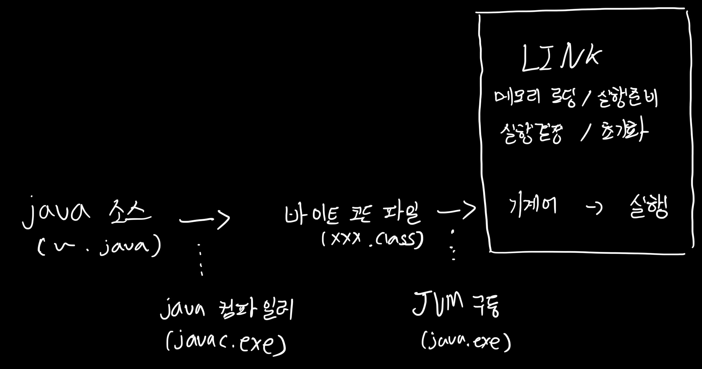

## 02. Java 프로그램의 실행 구조

##### 1) 환경 변수 설정

- `javac.exe(컴파일러)`, `java.exe(JVM 구동 명령)`를 다른 폴더에서도 실행할 수 있도록 하기 위해 환경변수(path)에 `bin`폴더를 등록한다.

- 시스템 변수 - 이 컴퓨터를 사용하는 모든 사용자, `특정 닉네임`에 대한 사용자 변수 - 각각의 사용자만이 사용하는 사용자 변수이다.

- JAVA_HOME이라는 변수 이름을 추가해주어 **자바가 어디에 있는지** 명시 해준다.

  

- path에는 `bin`폴더가 어디에 있는지 확인 후 변수에 추가해준다.

##### 2) Java 컴파일러와 JVM

- java 프로그램 실행 순서

  

  java 소스까지 짜놓으면 Eclipse에서 뒤의 과정들을 자동으로 처리해준다.

##### GC(Garbage Collection)

개발자가 메모리에 직접 접근이 불가하다. 따라서 개발자는 메모리를 관리를 할 수 없고, 가비지 컬렌션이 불필요한 메모리를 회수해서 메모리를 최적화하는 것이다. 

C계열의 프로그램의 같은 경우에는 개발자가 직접 메모리를 관리하며, 만약 메모리 관리에 문제가 생긴다면 다른 프로그램이 정지될 수 있다. 자바는 이러한 것을 가비지 컬렉션이 자동으로 해주는 점이 강점이라고 할 수 있다.

