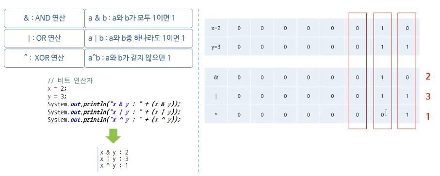

## 04. 특수문자 & 연산자

##### 1) 특수문자

일반 문자가 아닌 특수한 목적으로 사용되는 문자이다.

| 특수문자 |             의미             |
| :------: | :--------------------------: |
|    \t    |       탭(4자 띄운다.)        |
|    \n    |           줄 바꿈            |
|   \\'    |         작은 따옴표          |
|   \\''   |          큰 따옴표           |
|   \\\    |           역슬래쉬           |
|    //    | 주석 - 컴파일을 하지 않는다. |
|   /**/   |         여러줄 주석          |


##### 2) 서식 문자

서식에 사용되는 문자로 `printf()` 메서드를 이용한다.

```java
System.out.printf('오늘은 매우 춥습니다. 오늘의 기온은 %d입니다.', -2);

// printf는 println과 다르게 자동줄바꿈이 이루어지지 않는다는 것을 주의하자.

```

- 서식문자 종류

  | 표기 | 의미   |
  | ---- | ------ |
  | %d   | 10진수 |
  | %o   | 8진수  |
  | %x   | 16진수 |
  | %c   | 문자   |
  | %s   | 문자열 |
  | %f   | 실수   |

  `%5d` - 오른쪽 정렬을 하며, 5칸을 차지하라는 의미

  `%.3f` - 소수점 뒤로 3자리수만 출력을하겠다.


##### 3) 대입 연산자

대입연산자는 오른쪽의 변수 혹은 결과를 왼쪽에 대입(할당)한다.

**`=`은 대입을 하는 것이고 `==`는 같다는 것을 표현**하는 것이다.

```java
// i, j에 각각 10, 101을 대입한다.
int i = 10;
int j = 101;
```


##### 4) 산술 연산자

+, -, *, /, % 등을 수행하는 연산자이다.

`/` - 나눗셈, `%` - 나머지이다.


##### 5) 복합 대입연산자

산술 연산자와 대입연산자를 합한 연산자이다.

`+=`, `-=`, `/=`, `*=`, `%=` 등이 존재한다. `a = a + 10`과  `a += 10`은 같은 식이다. 간단하게 표현하기 위해서 많이 사용된다.


##### 6) 관계 연산자

두개의 피연산자를 비교해서 `참/거짓`의 결과를 표시한다.

`>`, `<`, `==(같다)`, `!=(같지 않다)` 등이 존재한다.


##### 7) 증감 연산자

1만큼 증가 혹은 감소하는 연산자이다.

```java
int x = 10;
System.out.println("++x: " + (++x)); // out 11
x = 10;
System.out.println("x++: " + (x++)); // out 10

// 전위 연산자인 ++x는 먼저 값을 더한 후 출력을 하고
// 후위 연산자인 X++는 출력을 한 후 1을 더해주는 것이다.
```

`++`와 `--` 가 존재한다.


##### 8) 논리 연산자

- `&&` (AND)

  a && b - a와 b 모두 참이면 참

- `||`(OR)

  a || b - a와 b 중 하나라도 참이면 참

- `!`(NOT)

  !a: a의 상태를 부정(참이면 거짓을 출력)


##### 9) 조건(삼항) 연산자

`조건식 ? 식1: 식2` - 조건식이 참이면 식1을 실행, 거짓이면 식2를 실행한다.

```java
int i = 10;
int j = 20;
int cnt = 0;
cnt = (x > Y) ? 100 : 200;
System.out.println("cnt: " + cnt); // out 200
```


##### 10) 비트 연산자

메모리를 관리하는 일이 없는 JAVA에서는 많이 쓰이진 않는다. 데이터를 bit 단위로 환산하여 연산을 수행하며, 다른 연산자보다 연산 속도가 향상된다.

- `&` - a와 b 모두가 1이면 1
- `|` - a와 b 중 하나라도 1이면 1
- `^` - a와 b가 같지 않으면 1



**reference** - [인프런: 자바프로그래밍 입문, 7강](https://www.inflearn.com/course/%EC%8B%A4%EC%A0%84-%EC%9E%90%EB%B0%94_java-renew/lecture/13675)