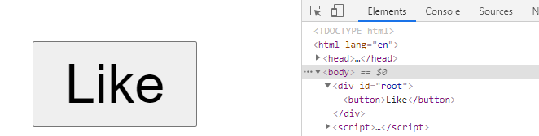

## My First React

1. load react script

   ```html
   <!-- 개발 시 -->
   <script src="https://unpkg.com/react@17/umd/react.development.js" crossorigin></script>
   <script src="https://unpkg.com/react-dom@17/umd/react-dom.development.js" crossorigin></script>
   
   <!-- 배포 시 -->
   <script src="https://unpkg.com/react@17/umd/react.production.min.js" crossorigin></script>
   <script src="https://unpkg.com/react-dom@17/umd/react-dom.production.min.js" crossorigin></script>
   ```

2. 리액트 돔을 선언

   ```js
   const e = React.createElement; // create react element
   
   class LikeButton extends React.Component {
       constructor(props) {
           super(props);
       }
   
       render() {
           return e("button", null, "Like"); // <butto>Like</button> 이 형태로 만들겠다.(선언한 것이지 아직 만든 것이 아니다.)
       }
   }
   ```

3. element를 표현

   ```js
   // id가 root인 곳에 붙이겠다.
   ReactDOM.render(e(LikeButton), document.querySelector("#root")); // 실제 화면에 반영(렌더링)
   ```

4. 최종 코드

   ```html
   <!DOCTYPE html>
   <html lang="en">
   <head>
       <meta charset="UTF-8">
       <meta http-equiv="X-UA-Compatible" content="IE=edge">
       <meta name="viewport" content="width=device-width, initial-scale=1.0">
   
       <!-- 개발 시 -->
       <script src="https://unpkg.com/react@17/umd/react.development.js" crossorigin></script>
       <script src="https://unpkg.com/react-dom@17/umd/react-dom.development.js" crossorigin></script>
   
       <!-- 배포 시 -->
       <!-- <script src="https://unpkg.com/react@17/umd/react.production.min.js" crossorigin></script>
       <script src="https://unpkg.com/react-dom@17/umd/react-dom.production.min.js" crossorigin></script> -->
   
       <title>My react</title>
   </head>
   <body>
       <div id="root"></div>
       <script>
           const e = React.createElement;
   
           class LikeButton extends React.Component {
               constructor(props) {
                   super(props);
               }
   
               render() {
                   return e("button", null, "Like"); // <butto>Like</button> 이 형태로 만들겠다.(선언한 것이지 아직 만든 것이 아니다.)
               }
           }
       </script>
       <script>
           // id가 root인 곳에 붙이겠다.
           ReactDOM.render(e(LikeButton), document.querySelector("#root")); // 실제 화면에 반영(렌더링)
       </script>
   </body>
   </html>
   ```


결과



