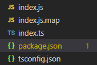

### 기본 설정

##### tsconfig.json

```json
{
    "compilerOptions": {
        "module": "commonjs",
        "target": "ES5",
        "sourceMap": true
    },
    // 포함할 것
    "include": ["index.ts"],
    // 제외할 것
    "exclude": ["node_modules"]
}
```

##### package.json

```json
{
  "name": "typeScript",
  "version": "1.0.0",
  "main": "index.js",
  "license": "MIT",
  "scripts": {
    // 처음 시작하는 명령어(yarn start 혹은 npm start 시)
    "start": "node index.js",
    // start전에 실행하는 명령어
    // typescript형태를 js형태로 변환
    "prestart": "tsc"
  }
}

```


##### yarn start(npm start) 시



index.js와 index.js,map 파일이 생성되며 js형태로 컴파일 되어 실행이 된다.