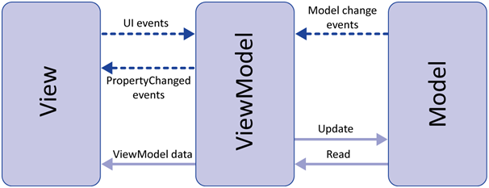

## 1. Vue.js를 사용하는 이유

#### 1) 학습하기 쉽다.

사람마다 학습을 받아들이는 것에 차이는 있겠지만, Vue는 angular와 react에 비해 학습하기 쉽다. 또한, Vue의 공식문서도 이해하기 쉽게 설명이 되어 있고, 한글 번역 또한 많이 이루어져 있어 학습하는 것에 용이하다.

#### 2) 컴포넌트

유지보수와 재사용성이 높은 컴포넌트 단위로 프로젝트를 관리할 수 있다. 이와 같은 부분은 Vue.js 뿐만 아니라 react, angular 역시 마찬가지이다.

Vue의 장점으로는 **단일 파일 컴포넌트**가 있다.

`~.vue` 파일 하나에 html, css, js를 작성할 수 있다. 즉, 단일 파일 컴포넌트는 캡슐화를 제공하게 된다. 이로써, 보다 깨끗한 컴포넌트를 표현할 수 있다.


#### 3) Vue.js는 가볍고 빠르다.

Virtual DOM에 있어서도 효과적인 성능을 낸다. 그렇기에, 적은 오버헤드와 빠른 성능을 낼 수 있다.


#### 4) View 최적화

Vue 디자인은 MVVM 패턴을 따라서, View에 최적화 되어 있다.

*MVVM이란?*



- Model이 비지니스 데이터를 관리하다가 값이 변경되면 ViewModel(VM)에게 변경 사항을 알린다.
- VM은 Model의 변경 내용을 화면인 View에게 알려서 반영하므로 사용자가 내용을 확인할 수 있게 된다.
- View를 보던 사용자가 어떤 입력 값을 변경하면 VM에게 데이터 바인딩에 대한 요청을 보낸다.
- VM은 실제 Model의 값을 변경하면서 데이터 일관성을 유지한다.
- View - HTML, CSS로 이뤄진 코드이며 VM은 Vue.js에서 제공하는 Vue 객체, Model은 자바스크립트의 객체 형태를 사용한다.


#### 5) 많은 모듈

중앙 집중식 상태 관리 저장소를 위한 `vuex`

SPA를 위한 `vue-router`

유효성 검증을 위한  `vue-validator`

HTTP, Ajax를 위한 `vue-resource`

등등 효율적이고 필요한 모듈이 웬만하면 존재한다.


#### Reference

[Vue.js 사용하는 이유 :: 마이구미](https://mygumi.tistory.com/206)

[MVVM과 VUe.js](https://goodteacher.tistory.com/195)


## 2. Vuex

Vuex는 Vue.js 애플리케이션에 대한 상태 관리 패턴 + 라이브러리입니다. 애플리케이션의 모든 컴포넌트에 대한 줒앙 집중식 저장소 역할을 하며 예측 가능한 방식으로 상태를 변경할 수 있습니다. 

- 지나치게 중첩된 컴포넌트를 통과하는 prop는 장황할 수 있고 형제 컴포넌트에서 작동하지 않는다.
- 부모/자식 인스턴스를 참조하거나 이벤트를 통해 상태의 여러 복사본을 변경 및 동기화 하려는 등의 해결 방법을 사용해야 한다.

이러한 패턴을 극복하고자 컴포넌트에서 공유된 상태를 추출하고 이를 전역 싱글톤으로 관리한다. 앱이 단순하다면 Vuex를 건너 뛰어도 되지만 대규모 SPA를 구축한다면 Vuex 사용을 적극 검토해봐야 한다.

#### 1) State

원본 소스의 역할을 하며, View와 직접적으로 연결되어 있는 Model이다.


#### 2) Mutations

state를 변경하는 유일한 방법이고 이벤트와 유사하다. mutation은 함수로 구현되며, 첫 번째 인자는 `state`를 받을 수 있고, 두 번째 인자는 `payload`를 받을 수 있다. 여기서 payload는 여러 필드를 포함할 수 있는 객체형태도 가능하다. mutation은 commit을 통해서만 호출 할 수 있다.

```vue
store.commit('setData', payload)
```


#### 3) Actions

Action은 mutation과 비슷하지만 비동기 작업이 가능하다는 특징을 가지고 있다. action은 첫 번째 인자를 `context` 인자로 받을 수 있으며 이 context에는 state, commit, dispatch, rootstate와 같은 속성들을 포함한다. Actoin은 dispatch를 통해서만 호출한다.

```vue
store.dispatch('setData', payload)
```


#### 4) Getters

VUe 컴포넌트에서 Computed와 같은 역할을 한다. getter의 결과는 종속성에 따라 캐시되고 일부 종속성이 변경된 경우메나 재계산된다. 즉, 특정 state에 대해 어떠한 연산을 하고 그 결과를 View에 바인딩할 수 있으며, state의 변경 여부에 따라 getter는 재계산이 되고 View 역시 업데이트를 일으킨다. **이때, state는 원본 데이터로서 변경이 일어나지 않는다.**


#### Reference

[Vuex](https://vuex.vuejs.org/kr/guide/mutations.html)

[[Vue.js]Vuex 개념부터 실무에서의 사용까지 배우기!!](https://kdydesign.github.io/2019/05/09/vuex-tutorial/)


## 3. 브라우저 크기

#### 1) 자바스크립트 이용

- window.innerWidth: 브라우저 *화면의 너비*
- window.innerHeight: 브라우저 *화면의 높이*
- window.outerWidth: 브라우저 *전체의 너비*
- window.outerHeight: 브라우저 *전체의 높이*

이후, EventListener를 활용하여 resize를 진행해주면 브라우저 크기에 따른 반응형 웹을 생성 가능


#### 2) 라이브러리 사용

라이브러리 설치

```bash
npm i vue-window-size
```

이후, import { useWindowSize } from 'vue-window-size'; 를 통하여 {{windowWidth(Height)}}사용 가능


