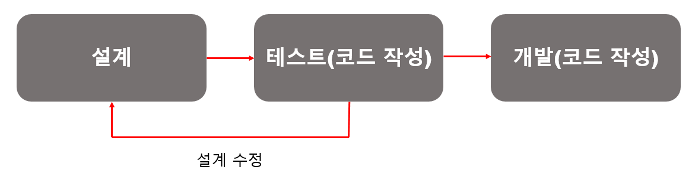

## 1. 좋은 코드란?

- 읽기 쉬운 코드

  ```
  모든 개발자가 동일한 배경지식을 가진 것은 아니다. 각자 다른 환경에서 코드를 작성하고 읽기 때문에 '읽기 쉽다'는 것은 개개인마다 다르다.
  
  알아 보기 쉬운 변수명, 적절한 주석의 활용 등을 통해 이해하기 쉬운 코드를 만드는 것이 좋다.
  ```

- 테스트가 용이한 코드

  ```
  테스트코드를 작성해두면 리팩토링할 때 수월하다.
  
  * 리팩토링: 외부동작을 바꾸지 않으면서 내부 구조를 개선하는 방법으로, 소프트웨어 시스템을 변경하는 프로세스이다. 예를 들어, 소프트웨어의 기능을 추가하는 것이 아닌, 단지 코드의 구조에만 신경을 쓰는 것이다.
  ```

- 중복이 없는 코드

  ```
  동일한 로직을 수행하는 코드는 별도의 함수로 구성하여 재사용
  ```


## 2. Object Oriented Programming(OOP)

객체 지향 프로그래밍으로서 현실 세계를 프로그래밍으로 옮겨와 프로그래밍하는 것

현실 세계의 `사물`들을 `객체`라고 바고 그 객체로부터 개발하고자 하는 애플리케이션에 필요한 특징들을 뽑아와 프로그래밍하는 것(추상화)이다. OOP로 코드를 작성하면 이미 작성한 코드에 대한 `재사용성`이 높다.


## 3. RESTful API

우선, **REST**란 "Representational State Transfer"의 약자이다. WWW와 같은 분산 하이퍼미디어 시스템을 위한 소프트웨어 아키텍처의 한 형식이다. REST란 "웹에 존재하는 모든 자원에 고유한 URI를 부여해 활용하는 것"으로, 자원을 정의하고 자원에 대한 주소를 지정하는 방법론을 의미한다.

- URI : 통합 자원식별자로 인터넷에 있는 자원을 나타내는 유일한 주소. URO의 존재는 인터넷에서 요구되는 기본조건으로서 인터넷 프로토콜에 항상 붙어다닌다.(URL, URN의 상위개념)

`RESTful`은 REST에 ~ful이라는 형용사형 어미를 붙여 ~한 API라는 표현으로 사용된다. 즉, REST의 기본 원칙을 성실히 지킨 서비스 디자인이라고 표현할 수 있다.

**특징**

1) Uniform(유니폼 인터페이스)

```
URI로 지정한 리소스에 대한 조작을 통일되고 한정적인 인터페이스로 수행하는 아키텍처 스타일
```

2) Stateless(무상태성)

```
작업을 위한 상태정보를 따로 저장하고 관리하지 않는다. 세션 정보나 쿠키정보를 별도로 저장하고 관리하지 않기 때문에 API 서버는 들어오는 요청만을 단순히 처리한다.
```

3) Cacheable(캐시 가능)

```
HTTP라는 기존 웹표준을 그대로 사용하기 때문에, 웹에서 사용하는 기존 인프라를 그대로 활용이 가능하다. HTTP가 가진 캐싱 기능을 적용하는 것도 가능

* 캐싱: 애플리케이션의 처리속도를 높여준다. 이미 가져온 데이터나 계산된 결과값의 복사본을 저장함으로서 처리 속도를 향상시키며, 향후 요청을 더 빠르게 처리가 가능하다.
```

4) Self-descriptiveness(자체 표현 구조)

```
REST API 메시지만 보고도 이를 쉽게 이해할 수 있는 지체 표현구조로 되어 있다.
```

5) Client - Server 구조

```
REST 서버는 API 제공, 클라이언트는 인증이나 컨텍스트(세션, 로그인 정보) 등을 직접관리하는 구조로 각각의 역할이 확실하게 구분된다. 때문에, 서로간의 의존성이 줄어든다.
```

6) 계층형 구조

```
REST서버는 다중 계층으로 구성될 수 있다.
```


**REST API 디자인 가이드**

URI는 정보의 자원을 표현해야 한다.

자원에 대한 행위는 HTTP Method(GET, POST, PUT, DELETE)로 표현한다.


[참고] **HTTP 응답 상태 코드**

1. 200 - 클라이언트의 요청을 정상적으로 수행
2. 201 - 클라이언트가 어떠한 리소스 생성을 요청, 해당 리소스가 성공적으로 생성됨(POST 작업 시)
3. 400 - 클라이언트의 요청이 부적절한 경우
4. 401 - 클라이언트가 인증되지 않은 상태에서 보호된 리소스를 요청했을 때
5. 403 - 유저 인증상태와 관계없이 금지된 요청을 하였을 경우
6. 404 - 페이지가 없을 경우 혹은 보여주고 싶지 않은 페이지일 경우 반환
7. 405 - 클라이언트가 요청한 리소스에서 사용 불가능한 Method를 이용했을 경우
8. 301 - 클라이언트가 요청한 리소스에 대한 URI가 변경되었을 경우
9. 500 - 서버에 문제가 있을 경우


## 4. TDD(Test-Driven Development)

테스트 주도 개발로 매우 짧은 개발 사이클을 반복하는 소프트웨어 개발 프로세스 중 하나이다. 개발자는 요구되는 새로운 기능(개발)에 대한 자동화된 테스트케이스를 작성하고 해당 테스트를 통과하는 가장 간단한 코드를 작성한다. 여기서 테스트를 통과하게 된다면 상황에 맞게 리팩토링하는 과정을 거친다. 즉, 테스트가 코드 작성을 주도하는 개발방식인 것이다.

[기존의 개발 프로세스]


[TDD 프로세스]



**[Add a test]**

테스트 주도 개발에선, 새로운 기능을 추가하기 전 테스트를 먼저 작성하는데, 테스트를 작성하기 위해서 개발자는 해당 기능의 요구사항과 명세서를 분명히 이해하고 있어야 한다. 이는 개발자가 콛를 작성하기 전에 보다 요구사항에 집중할 수 있도록 도와준다.

**[Run all tests and see if new one fails]**

새로운 기능을 추가할 때 테스트 코드를 작성함으로써, 새로운 기능이 제대로 작동함 + 기존의 기능들이 잘 작동하는지를 테스트를 통해 확인할 수 있다.


## Cookies와 Session

#### 1) 쿠키(Cookie)

HTTP의 일종으로 사용자가 어떠한 웹 사이트를 방문할 경우, 그 사이트가 사용하고 있는 서버에서 **사용자의 컴퓨터에 저장하는 작은 기록 정보 파일**이다. HTTP에서 클라이언트의 상태 정보를 클라이언트의 PC에 저장하였다가 필요 시 정보를 참조하거나 재사용할 수 있다.

**특징**

- **이름, 값, 만료일(저장기간 설정), 경로 정보**로 구성되어 있다.
- 클라이언트에 총 300개의 쿠키를 저장할 수 있다.
- 하나의 도메인 당 20개의 쿠키를 가질 수 있다.
- 하나의 쿠키는 4KB까지 저장 가능하다.

**사용 예시**

1. 방문했던 사이트에 다시 방문하였을 때 아이디와 비밀번호 자동 입력
2. 팜업창을 통해 "오늘 이 창을 다시 보지 않기" 체크 등등


#### 2) 세션(Session)

방문자가 웹 서버에 접속해 있는 상태를 하나의 단위로 보고 그것을 세션이라고 한다.

**특징**

- 저장 데이터에 제한이 없다.
- 브라우저를 닫거나, 서버에서 세션을 삭제했을 때만 삭제가 되므로 쿠키보다 비교전 **보안이 좋다.**
- 각 클라이언트 고유 Session ID를 부여한다. Session ID로 클라이언트를 구분하여 각 클라이언트 요구에 맞는 서비스 제공

**사용 예시**

1. 화면이 이동해도 로그인이 풀리지 않고 로그아웃하기 전까지 유지


#### 3) 쿠키와 세션의 차이

|           | 쿠키(Cookie)                                                | 세션(Session)         |
| --------- | ----------------------------------------------------------- | --------------------- |
| 저장 위치 | 클라이언트(접속자 PC)                                       | 웹 서버               |
| 저장 형식 | text                                                        | Object                |
| 만료 시점 | 쿠키 저장 시 설정                                           | 브라우저 종료 시 삭제 |
| 리소스    | 클라이언트 리소스                                           | 웹 서버 리소스        |
| 용량 제한 | 총 300개<br />하나의 도메인 당 20개<br />하나의 쿠키 당 4KB | 서버가 허용하는 양    |
| 속도      | 세션보다 빠름                                               | 쿠키보다 느림         |
| 보안      | 세션보다 안좋음                                             | 쿠키보다 좋음         |


